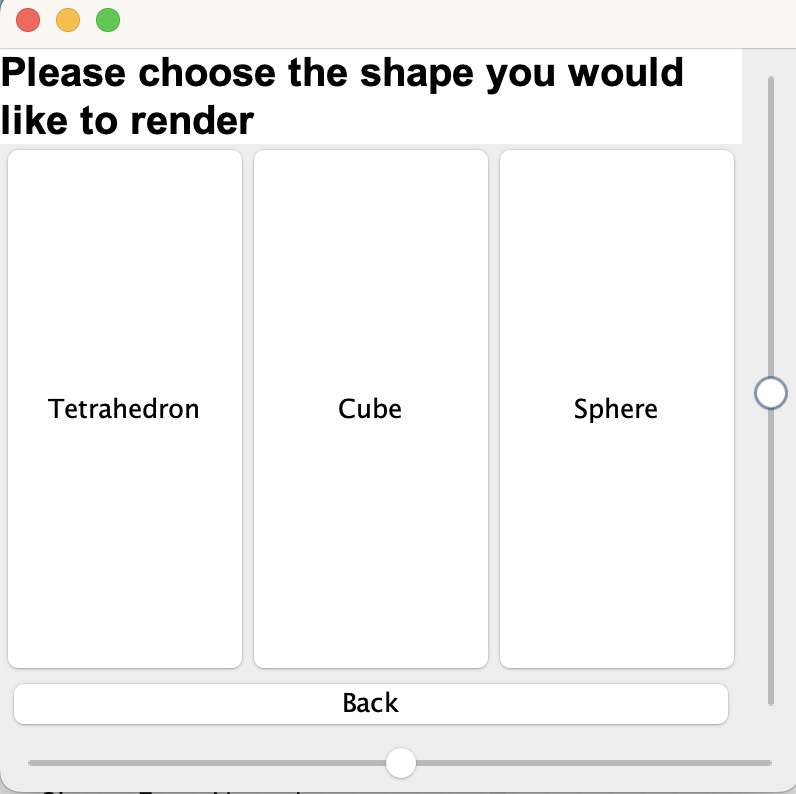
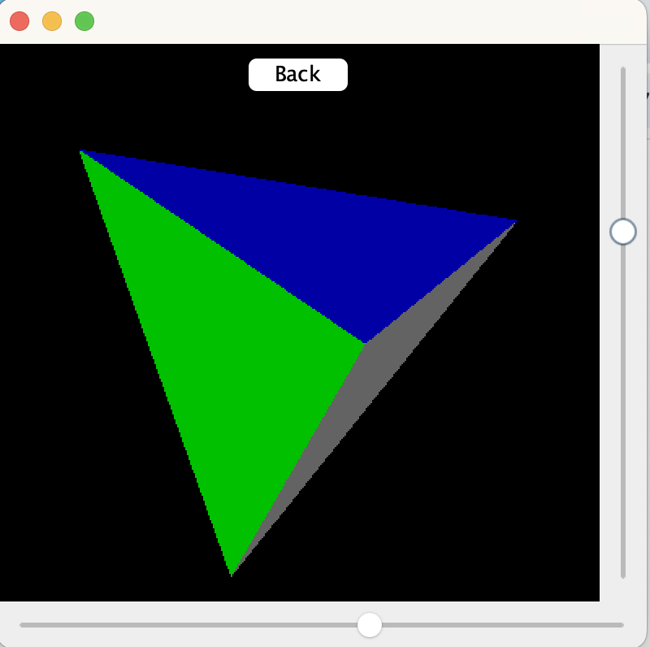
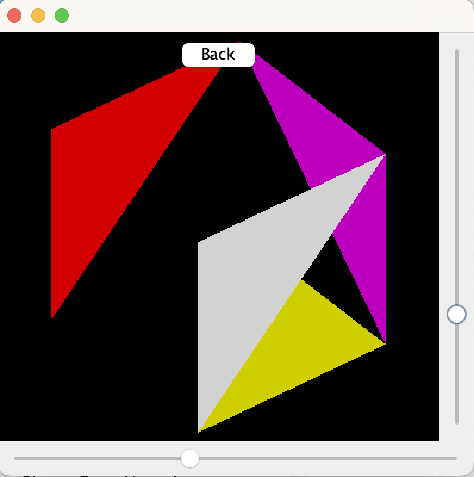

# 3DRenderer

## Overview
Java app that renders a 3-d object. 

## Features
- 3D shape rendering with sliders to control rotation
- Shape selection ~ allow user to select the shape to be rendered using the GUI

## Structure
- DemoViewer.java: Controls the GUI, rendering, and user interaction
- ShapeFactory.java: Factory class for creating 3D shapes
- Cube.java and Tetrahedron.java: Model classes defining vertices and faces for each shape
- Matrix3.java: Matrix operations for transforming shape vertices
- Vertex.java: Represents a vector
- Triangle.java and Square.java: Represent the faces of shapes

## Sources
http://blog.rogach.org/2015/08/how-to-create-your-own-simple-3d-render.html
The tutorial above was used to learn how to create a 3-d tetrahedron. The user controls and cube rendering were added on to it by me. 

## Known issues
The rendering of the cube is not fully correct. It is rendered as 6 faces formed of triangles, not squares
